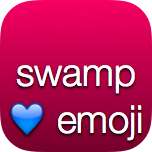

# swamp

Icon stamping in Swift with zero dependencies. A lovely addition to every build
process.

## How to use

1. Switch your Xcode using `sudo xcode-select -switch /Applications/Xcode6-Beta4.app/`
2. Call swamp like so: `./swamp.swift -- input.png output.png "Hello World"`  
   If you're seeing crazy unicode noise or `<unknown>:0: no such file or directory: 'input.png'`, you most likely forgot the `--`.

Ported from [stamp](https://github.com/jberkel/stamp) by [Jan
Berkel](https://github.com/jberkel).

